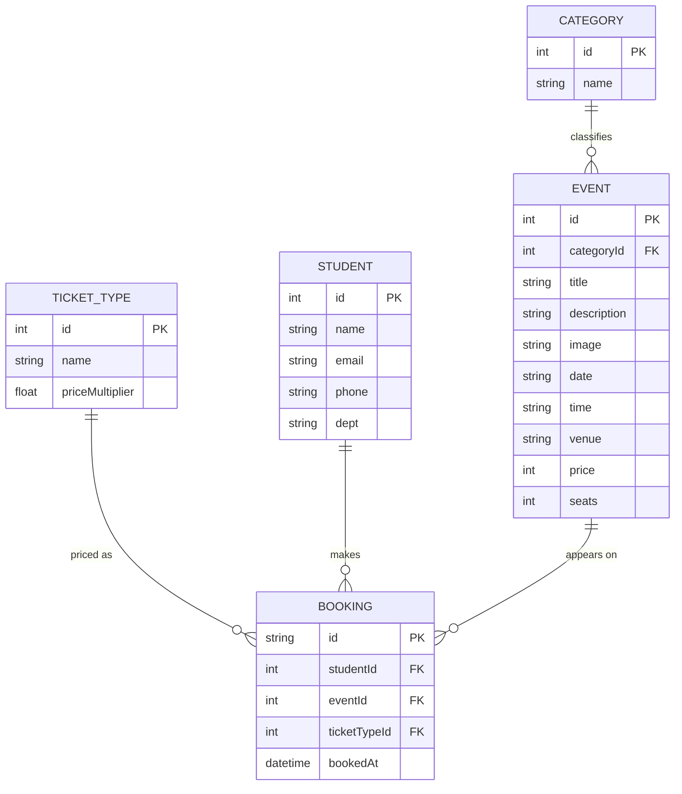

# ER Diagram

Two views are given below.

1. **Conceptual (normalized) model** — the 5-entity design a real database
   version of this project would use. This is the diagram to show in the
   viva.
2. **Implementation model** — how the data is actually stored in this demo
   (denormalized, in localStorage). Included for honesty.

---

## 1. Conceptual (normalized) ER diagram

### Entities explained

| Entity        | Meaning                                            | Where it lives in the code                     |
|---------------|----------------------------------------------------|------------------------------------------------|
| CATEGORY      | Event type: Technical / Workshop / Cultural / Sports | Filter buttons in `events.html`              |
| TICKET_TYPE   | General / Student / VIP                            | `<select id="ticket">` in `register.html`      |
| STUDENT       | The person registering                             | The form fields in `register.html`             |
| EVENT         | A campus event                                     | The `EVENTS` array in `js/data.js`             |
| BOOKING       | One student's registration for one event           | The object passed to `addBooking()`            |

### Relationships and cardinalities

| Relationship                  | Cardinality | Explanation                                     |
|-------------------------------|-------------|-------------------------------------------------|
| CATEGORY → EVENT              | 1 : N       | One category has many events                    |
| TICKET_TYPE → BOOKING         | 1 : N       | One ticket type is used on many bookings        |
| STUDENT → BOOKING             | 1 : N       | One student makes many bookings                 |
| EVENT → BOOKING               | 1 : N       | One event has many bookings                     |

BOOKING is an **associative entity** (a junction table) — it resolves the
many-to-many relationship between STUDENT and EVENT. A student can register
for many events, and an event can have many students.

---

## 2. Implementation model (what the code actually does)

For the demo we did NOT build a real database. The data is stored flat in
two places:

### Why the difference? (likely viva question)

> "The conceptual model is normalized into 5 entities. In the
> implementation we deliberately denormalized: STUDENT fields live inside
> the booking object, CATEGORY is stored as a plain string on the event,
> and TICKET_TYPE is stored as a plain string on the booking. We also copy
> the event title/date/venue/price into each booking. This is because the
> demo uses the browser's localStorage, not a real database, so there are
> no JOINs — duplicating the data makes the 'My Bookings' page simpler to
> render. A production version would use the normalized 5-table schema
> shown above with a SQL backend."

---

## Reading the notation

- `||--o{` means "one side has zero-or-many of the other" (a one-to-many
  relationship).
- `PK` = primary key (unique identifier for a row).
- `FK` = foreign key (a column that references another table's primary key).
- An **associative entity** (like BOOKING) is a table whose main job is to
  connect two other tables in a many-to-many relationship.
