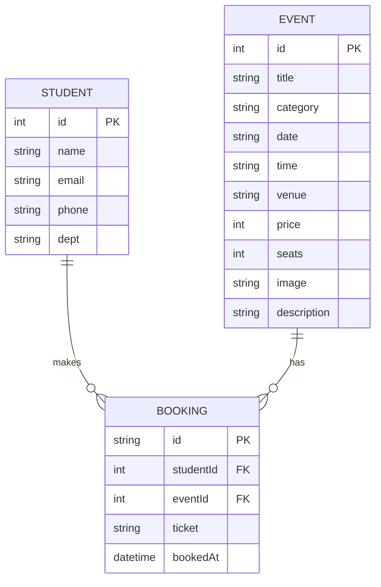

# ER Diagram

Three entities, faithful to the actual code:
- **STUDENT** — the form data captured in `register.html`
- **EVENT** — the `EVENTS` array in `js/data.js`
- **BOOKING** — the object passed to `addBooking()`, saved in localStorage

---

## Reading the notation

- `||--o{` = one-to-many (one side has zero or many of the other).
- `PK` = primary key (uniquely identifies a row).
- `FK` = foreign key (references another entity's primary key).

---

## Relationships and cardinality

| Relationship       | Cardinality | Meaning                                       |
|--------------------|-------------|-----------------------------------------------|
| STUDENT → BOOKING  | 1 : N       | One student can make many bookings            |
| EVENT → BOOKING    | 1 : N       | One event can have many bookings              |

**BOOKING is an associative (junction) entity.** It resolves the
many-to-many relationship between STUDENT and EVENT: a student can register
for many events, and an event can be booked by many students.

---

## Viva one-liner

> "There are three entities. STUDENT and EVENT are the main entities, and
> BOOKING is the associative entity between them — a student makes many
> bookings, and an event has many bookings. The relationship between
> STUDENT and EVENT is many-to-many, resolved through BOOKING."

---

## Implementation note (if asked)

> "In the actual demo we store this in the browser's localStorage rather
> than a database, so the STUDENT fields are kept inside the booking object
> instead of in a separate table. The conceptual model above is what a
> proper database version would use."

---

## Field mapping to the actual code

| Diagram field        | Source                                          |
|----------------------|-------------------------------------------------|
| STUDENT.name/email/phone/dept | form inputs in `register.html`         |
| EVENT.*              | keys in the `EVENTS` array (`js/data.js`)       |
| BOOKING.id           | generated inside `addBooking()` in `data.js`    |
| BOOKING.eventId      | `eventId: event.id` in `register.html`          |
| BOOKING.ticket       | `ticket: ticket` in `register.html`             |
| BOOKING.bookedAt     | set inside `addBooking()` in `data.js`          |
