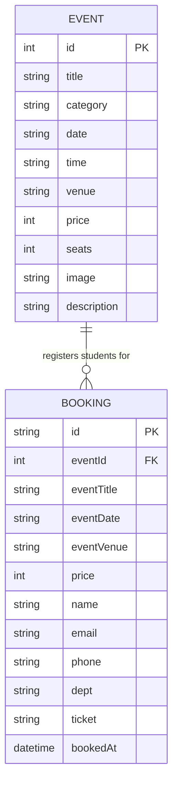

# ER Diagram

This is the data model used by EduEvents. It is faithful to the actual code
in `js/data.js` (the EVENTS array) and the booking object built in
`register.html` (the `addBooking({...})` call).

---

## Reading this diagram

- **EVENT** = one campus event (a row in the `EVENTS` array in `js/data.js`).
- **BOOKING** = one student's registration for one event (saved in
  `localStorage` under the key `edu_events_bookings`).
- **EVENT ||--o{ BOOKING** = a "one-to-many" relationship: one event can
  have many bookings, but each booking belongs to exactly one event.
- **PK** = primary key (uniquely identifies a row).
- **FK** = foreign key (links a booking to its event via `eventId`).

---

## Cardinality (be ready to say this in the viva)

> "One event can have zero or many bookings. One booking belongs to exactly
> one event. So the relationship between EVENT and BOOKING is one-to-many
> (1 : N)."

---

## Why does BOOKING store eventTitle, eventDate, eventVenue, price
## when those already exist in EVENT?

Good viva question. Honest answer:

> "It is denormalized on purpose. In this demo the EVENTS list lives in a
> JavaScript array, while bookings are saved in localStorage. To show a
> booking on the 'My Bookings' page without having to look up the event
> again, we copy the event details into the booking at the moment of
> registration. The cost is duplicated data; the benefit is simpler code.
> In a real system with a proper database we would store only the
> `eventId` foreign key and JOIN the tables."

---

## Notes on types

- `int` = whole number (e.g. event id = 3, seats = 120, price = 100).
- `string` = text (title, name, email, etc.).
- `date` / `datetime` = a date or full timestamp (bookedAt records when the
  booking was made, using ISO format).
- `price` can be `0`, which means the event is free (shown as "FREE" on the
  site).

---

## How this maps to the actual code

| Diagram field    | Where it comes from                              |
|------------------|--------------------------------------------------|
| EVENT.id         | `id` in the `EVENTS` array (`js/data.js`)        |
| EVENT.*          | other keys in each event object                  |
| BOOKING.eventId  | `eventId: event.id` in `register.html`           |
| BOOKING.eventTitle / eventDate / eventVenue / price | copied from event in `register.html` |
| BOOKING.id       | generated inside `addBooking()` in `data.js`     |
| BOOKING.bookedAt | set inside `addBooking()` in `data.js`           |
| BOOKING.name / email / phone / dept / ticket       | form inputs in `register.html`     |
